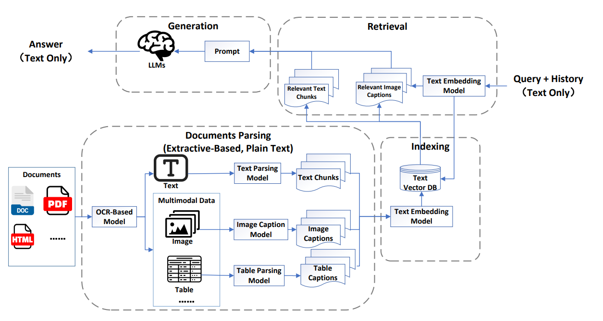

# multimodal RAG

This project aims to enhance **Multimodal Retrieval-Augmented Generation (MRAG)** by improving the retriever’s ability to locate cross-modal evidence that truly supports answer generation. 

We move beyond a pseudo-MRAG baseline through two main strategies: constructing **vector databases** with heterogeneous embeddings and introducing **multimodal rerankers** to refine retrieval quality. 

The approach is evaluated on **ScienceQA** for multimodal reasoning and **Flickr30k** for image-text alignment, assessing both retrieval performance and overall generation quality.

## Method



## Folder
```
multimodality_rag/
│
├── README.md                      # Project documentation and usage guide
├── requirements.txt               # Environment dependencies
│
├── configs/                       # ⚙️ Configuration & ablation setups
│   ├── base.yaml                  # Baseline: text-only pipeline
│   ├── ablation_image.yaml        # Adds image modality
│
├── data/                          # Datasets & intermediate results
│   ├── flickr30k/                 # Retrieval-level evaluation data
│   ├── scienceqa/                 # End-to-end generation evaluation data
│   ├── processed/                 # Parsed intermediate data (text/image features)
│
├── src/                           # Source code
│   ├── __init__.py
│   │
│   ├── parsing/                   # ① Document Parsing
│   │   ├── text_parser.py         # Process textual data (baseline)
│   │   ├── image_parser.py        # Extract image features or generate captions
│   │
│   ├── indexing/                  # ② Indexing
│   │   ├── faiss_indexer.py       # Build FAISS index for fast retrieval
│   │   └── utils_index.py         # Index utilities: cache, load, update
│   │
│   ├── retrieval/                 # ③ Retrieval
│   │   ├── text_retriever.py      # Dual-encoder text embedding and retrieval
│   │   ├── reranker.py            # Cross-encoder or L2R reranking
│   │   └── metrics_retrieval.py   # Compute metrics (NDCG@K, Recall@K)
│   │
│   ├── generation/                # ④ Generation
│   │   ├── generator.py           # Main RAG generation module (e.g., T5, LLaVA)
│   │
│   └── evaluation/                # ⑤ Evaluation
│       ├── evaluate_flickr.py     # Evaluate retrieval on Flickr30k
│       ├── evaluate_scienceqa.py  # Evaluate generation on ScienceQA
│       └── visualize_results.py   # Plot and compare ablation results
│
└── scripts/                       # Experiment & run scripts
    ├── run_baseline.sh            # Run text-only baseline
    ├── run_ablation_image.sh      # Run with image modality enabled
```

## Reference
1. L. Mei et al., “A Survey on Multimodal Retrieval-Augmented Generation,” arXiv:2504.08748, 2025.